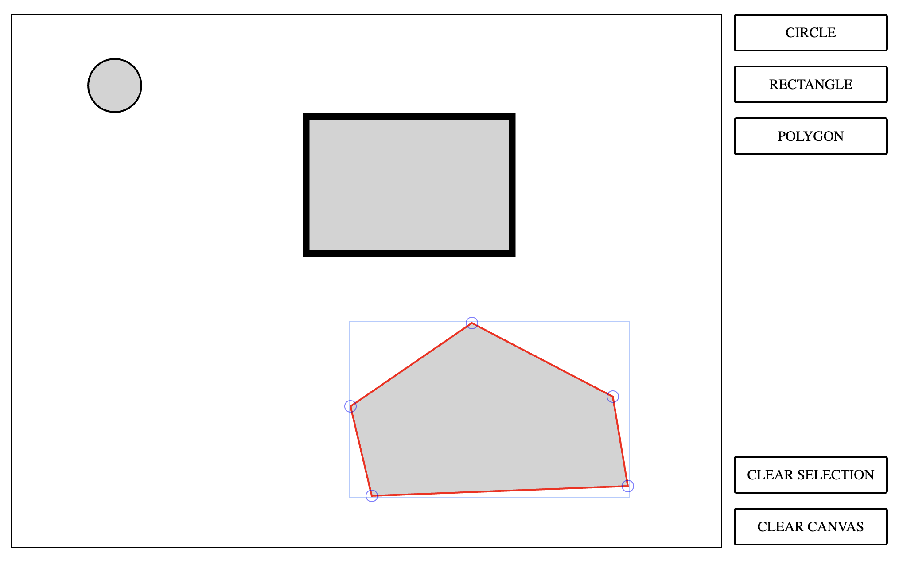

# FabricJS 7 + React + TypeScript + Vite

[FabricJS](https://fabricjs.com/) is a great library for drawing on an HTML 5 canvas. Unfortunately, the documentation of the latest FabricJS version, 7, is (currently) lacking basic examples.
For a professional project, I needed to properly understand how to do basic (and slightly more advanced) things in a FabricJS 7 + React + TypeScript + Vite stack. Therefore, I've created a small demo web app that you can find at https://robvanderleek.github.io/fabricjs7-react-typescript-vite/ (see screenshot below).

